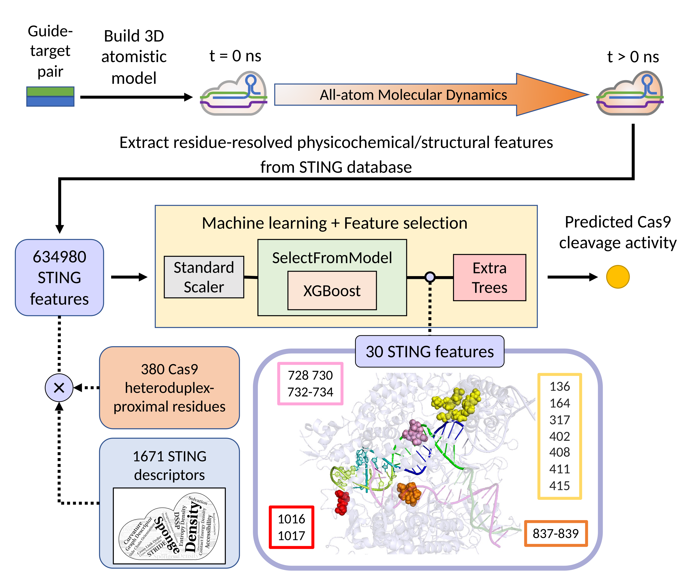

# Code accompanying "Learning to utilize internal protein 3D nanoenvironment descriptors in predicting CRISPR-Cas9 off-target activity"

This Github repository contains sample Python scripts and CSV datasets relating to the trained extra trees model STING_CRISPR produced in the paper "Learning to utilize internal protein 3D nanoenvironment descriptors in predicting CRISPR-Cas9 off-target activity".



## Models
This repository contains the following models in the ```models``` folder:
|      File      |  Description   |
| ---------------|--------------- |
| STING_CRISPR.joblib | A trained three-stage ML pipeline containing StandardScaler, a SelectFromModel feature selector with XGBoost as the base model, and an extra trees model (i.e., STING_CRISPR) |

## Data
This repository contains the following CSV files in the ```data``` folder:

| File | Description |
| --------------|------------ |
| activity_labels.csv | CRISPR-Cas9 off-target cleavage activities for the 28 studied (off-)target molecular dynamics trajectories |
| cas9_nucleotide_distances.csv | Distances between heteroduplex-proximal reisdues and heteroduplex nucleotides for all CMUT trajectories |
| desc2desctype.csv | Lists the parent descriptor class, aggregation type and the (neighbor) descriptor class for all studied STING descriptors
| example_input.csv | STING_CRISPR input feature values for the first PDB snapshot for trajectory CMUT1 |
| fig4f.png | Raw image used for Figure 4F (PAM-distal visualization) |
| fig4g.png | Raw image used for Figure 4G (PAM-proximal visualization) |
| hyperparam_search_5cv_results.csv | Performance results obtained after grid search and five-fold cross validation of the ML pipeline |
| residue_dists.csv | Pairwise Cα-Cα residue distances for residues in STING_CRISPR |
| X.csv | STING_CRISPR input feature values for all 672 PDB snapshots |


## Demo Scripts
Sample Python scripts for users to play around with.
|  File  | Description  | Command |
| -------|------------- | ------- |
| demo_predict_one.py | Uses STING_CRISPR to make a prediction for the nanoenvironment of the first PDB snapshot obtained in the on-target trajectory, i.e., CMUT1 | ```python demo_predict_one.py``` |
| model_perf.py | Quantifies STING_CRISPR model performance |  ```python model_perf.py``` |

## Reproducibility Scripts
Python scripts for reporducing main manuscript figures and Figure S2.
|  File  | Description  | Expected Output | Command |
| -------|------------- | --------------- | ------- |
| fig2a.py | Python script for reproducing Figure 2A | [out/fig2a.pdf](out/fig2a.pdf) |  ```python fig2a.py``` |
| fig3.py  | Python script for reproducing Figure 3  | [out/fig3.pdf](out/fig3.pdf)   |  ```python fig3.py```  |
| fig4.py | Python script for reproducing Figure 4 | [out/fig4.pdf](out/fig4.pdf) |  ```python fig4.py``` |
| fig5.py  | Python script for reproducing Figure 5  | [out/fig5.pdf](out/fig5.pdf)   |  ```python fig5.py```  |
| figS2.py | Python script for reproducing Figure S2 | [out/figS2.pdf](out/figS2.pdf) |  ```python figS2.py``` |

## Related Zenodo Repositories
|   DOI  | Description |  URL |
| -------|-------------|------|
| 10.5281/zenodo.7837070 | Structural stability analysis summary | https://zenodo.org/record/7837070 |
| 10.5281/zenodo.8028221 | CRISPR-Cas9 STING descriptor values | https://zenodo.org/record/8028221 |

# Installation
Install the required Python packages as listed below.

# Requirements
```matplotlib==3.5.3 numpy==1.24.3 shap==0.38.1 scipy==1.7.3 scikit-learn==1.0.2 pandas==1.5.2 xgboost==1.5.0 joblib==1.2.0```

# Contacts
jeffrey.kelvin.mak@cs.ox.ac.uk or peter.minary@cs.ox.ac.uk
